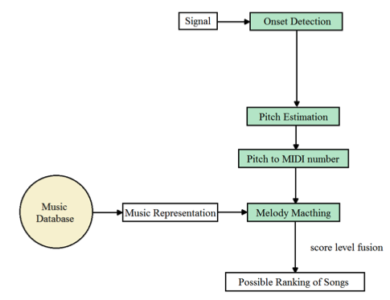

# QBH Project (Query by Humming System)
本專案實作了一個 Query by Humming (QBH) 系統，允許使用者透過哼唱錄音搜尋歌曲，並以多種方法計算查詢與目標歌曲的相似度。另外，經過比較不同篇相關研究論文並實作其方法，在持續比較下提升系統的準確度。


[圖片參考林巧薇同學論文]

相關文獻閱讀筆記與研究報告在 [Notion](https://mire-power-709.notion.site/Proposed-QBH-Query-by-Humming-1b7b695eb67681fa90ddf02175f09d35)

__本系統分為三個部分__：
發端識別(Onset Detection) → 音高估計(Pitch Estimation) → 旋律比對(Melody Matching)
* __Onset Detection__: 偵測 input 音訊中振幅較高的地方作為起始點 (onset)
* __Pitch Estimation__: 提取音高資訊並經過 Fourier Transform 轉換為 MIDI 音高差 (diff)
* __Melody Matching__: 利用 Hidden Markov Model (HMM) 與 Dynamic Programming 得出比對分數排名

## 專案結構
專案中的所有程式統一放在 `src/` 目錄下，以下說明各檔案的用途：
```
.
│── OnsetDetection.py                   # 音訊起始點偵測
│── PitchEstimation.py                  # 音高偵測與 MIDI 差值計算
│── MelodyMatching.py                   # 簡譜轉換為 MIDI diff
│── HMM.py                              # HMM 演算法與分數計算
│── DP.py                               # DP 匹配與分數計算
│── main.py                             # 主程式
│
├── hummingdata/                        # 測試用哼唱音訊資料 (注一)
│   ├── Target_tempo_50_utf-8.txt       # 目標歌曲資料 (注二)
│   ├── 10/                             # 10 秒的測試資料
│   ├── 15/                             # 15 秒的測試資料
│   └── 20/                             # 20 秒的測試資料
│
└── Project_in_Lin's_thesis/            # 根據林同學論文的程式實作
    ├── HMM_midi_diff                   # 根據 HMM_builder.py 產生的目標歌曲 HMM
    ├── HMM_builder.py                  # 針對目標歌曲產生 HMM 的工具
    ├── LevelFusion.py                  # 林同學論文提出的篩選歌曲機制程式 (注三)
    └── MDP.py                          # 林同學論文提出的 Dynamic Programming algorithm (注四) 
```
 
* 注一: `hummingdata/` 內容由丁建均老師提供，本專案不包含內容檔案，需手動建置資料夾
* 注二: `Target_tempo_50_utf-8.txt` 內容格式應為
    ```
    歌曲名　　　　　　　　　　　　　　　　　MIDI number                     /beats
    三輪車　　　　　　　　　　　　　　　　　11235535567HH5HH6536532123565321/22222242222224222222211211211224
    ...
    ```
* 注三: `LevelFusion.py` 僅在測試時使用，對整體程式碼無關
* 注四: `MDP.py` 僅在測試時使用，對整體程式碼無關

## 設定與安裝
* __套件安裝__:
直接安裝套件或是使用虛擬環境
```
pip install numpy scipy matplotlib
```
* __檔案配置__:
在 `hummingdata/` (query) 中放入需查詢的 `.wav` 檔案，分為10秒、15秒、20秒
將 `Target_tempo_50_utf-8.txt` (target) 作為歌曲資料庫

## 使用流程
### 批次哼唱歌曲必較
1. __準備資料__
* 將哼唱音訊 (`.wav`) 放到 `hummingdata/10` 或 `/15` 、 `/10`
* 確認目標歌曲資料 (`Target_tempo_50_utf-8.txt`) 已正確放置
* 修改 `Project_in_Lin's_thesis/HMM_builder.py` 的目標歌曲指向位置後執行，對目標歌曲資料進行 HMM 建模
* 修改程式碼中 `query_dir` 、 `transtition_matrix_folder` 、 `target_file` 的指向位置
    ```
    example:
    query_dir = "hummingdata/10"
    transtition_matrix_folder = "Project_in_Lin's_thesis/HMM_midi_diff"
    target_file = "hummingdata/Target_tempo_50_utf-8.txt"
    ```
2. __執行主程式__
```
python main.py
```
程式會先依照對每首 query 歌曲個別計算 Threshold，之後每首 query 歌曲與 target file 比對完後，輸出正確率與 Best Match

## 使用工具與套件
* __Python3__
* __numpy__: 矩陣運算
* __scipy__: fft 運算與卷積運算
* __matplotlib__: 結果繪圖與可視化

## __注意事項__
* 若歌曲資料庫或是需查詢歌曲超過數百首，計算可能耗時
* 本專案在大於 20 秒歌曲查詢時表現較佳